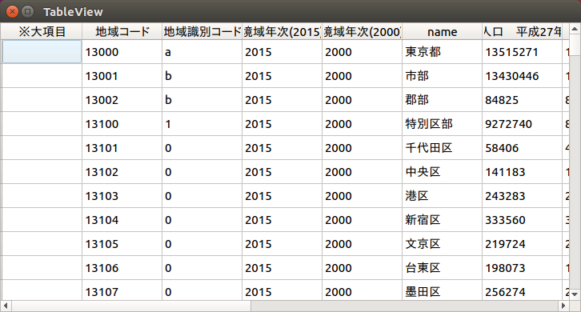

# idata

readable data interface configuration for the 21st Century

<small>So... Am I living in the 21st century??? serious.</small>

## Usage

```python
import idata.config
config = idata.config.load_yaml("config/e-stat.go.jp/kokusei/2015/population/001.yml")
UNCIVILIZED_CP932 = "cp932"
source = config.load("data/e-stat.go.jp/kokusei/2015/population/13/001_13.csv", encoding=UNCIVILIZED_CP932)
print(source.frame)
```

stdout:
```
※大項目  地域コード 地域識別コード 境域年次(2015) 境域年次(2000)          name to21-01.0001  \
0         13000       a       2015       2000           東京都     13515271   
1         13001       b       2015       2000            市部     13430446   
2         13002       b       2015       2000            郡部        84825   
3         13100       1       2015       2000          特別区部      9272740   
4         13101       0       2015       2000          千代田区        58406   
5         13102       0       2015       2000           中央区       141183   
6         13103       0       2015       2000            港区       243283   
7         13104       0       2015       2000           新宿区       333560   
8         13105       0       2015       2000           文京区       219724   
9         13106       0       2015       2000           台東区       198073   
10        13107       0       2015       2000           墨田区       256274   
11        13108       0       2015       2000           江東区       498109   
12        13109       0       2015       2000           品川区       386855   
13        13110       0       2015       2000           目黒区       277622   
14        13111       0       2015       2000           大田区       717082   
15        13112       0       2015       2000          世田谷区       903346   
16        13113       0       2015       2000           渋谷区       224533   
17        13114       0       2015       2000           中野区       328215   
18        13115       0       2015       2000           杉並区       563997   
19        13116       0       2015       2000           豊島区       291167   
20        13117       0       2015       2000            北区       341076   
21        13118       0       2015       2000           荒川区       212264   
22        13119       0       2015       2000           板橋区       561916   
23        13120       0       2015       2000           練馬区       721722   
24        13121       0       2015       2000           足立区       670122   
25        13122       0       2015       2000           葛飾区       442913   
26        13123       0       2015       2000          江戸川区       681298   
27        13201       2       2015       2000          八王子市       577513   
28        13202       2       2015       2000           立川市       176295   
29        13203       2       2015       2000          武蔵野市       144730   
..   ...    ...     ...        ...        ...           ...          ...   
```

### Search column

```python
import idata.db
db = idata.db.open("config/")
db.search(["人口", "27年"])
# [<Column: 国勢調査:"人口　平成27年">, <Column: 国勢調査:"平成22年～27年の人口増減数">, <Column: 国勢調査:"平成22年～27年の人口増減率（％）">]
```

### Detect by file

```python
import idata.db
db = idata.db.open("config/")
db.detect_by_file("data/e-stat.go.jp/jyutaku/2013/city/13/a002.xls")
# <Source: 住宅・土地統計調査:"第１表　居住世帯の有無(8区分)別住宅数及び住宅以外で人が居住する建物数―市区町村">
```

## PyQt5

```
./pyqt.py config/e-stat.go.jp/kokusei/2015/population/001.yml data/e-stat.go.jp/kokusei/2015/population/13/001_13.csv
```


